# Motion-based Authentication

## Project Overview

This project aims to develop a motion-based authentication system leveraging the accelerometer and gyroscope sensors in Android smartphones. By understanding and utilizing the Android operating system's capabilities and its interaction with these sensors, we will create a system that authenticates users based on specific movements of their smartphone.

Here we briefly go through the goals we aim to achieve: 
1. Learn Android Sensor Integration focusing on the accelerometer and gyroscope.
2. Motion Data collection
3. Pattern Authentication

## Challenges
the challenges we face in the project:
1. **Sensor Accuracy:** The accuracy of sensors (e.g., accelerometers, gyroscopes) used in mobile devices is a crucial factor. These sensors can be influenced by various factors such as hardware quality, calibration, environmental conditions, and the inherent noise in sensor readings. Inaccurate sensor data can lead to incorrect calculations of movement parameters such as distance traveled and changes in direction or angle. we have handled this challenge by implementing Kalman filters to smooth sensor data and reduce the impact of noise and drift.
2. **Saving the direction:** Calculating and saving the direction of movement based on the current position involves accurately interpreting sensor data and adjusting the position coordinates based on the angle of movement. This process can be complex due to the need to handle different angles correctly and ensure that the calculated position reflects the actual movement direction and distance. (you can see the code related to this challenge in the movement class file.)

## Project Directory Structure and Contents

- **.qmlproject file:** This file is a configuration file for a Qt Quick application. It outlines the structure and settings needed to organize and manage various resources and settings for the project. It ensures all necessary resources (QML files, JavaScript files, images, fonts, audio, video, shaders) are included and managed. also, it sets up environment variables for application configuration and debugging.
- **.qmlproject.qtds:** It is an XML file used by Qt Design Studio and Qt Creator to store various project-specific settings and configurations.
- **.qmlproject.user:** This is an XML file that stores user-specific project settings. These settings are typically customized by the user for their development environment.

** The three files above will be created automatically when we build our QtQuick project. 
  
- **.qml file:** This file defines an application window with a UI to display sensor data, handle calibration, and manage motion-based authentication. It includes UI elements like labels, text areas, and buttons for user interaction. and also includes some logic to handle accelerometer and gyroscope data, including updates and calibration and the functions to update the UI and manage the state of the application based on sensor readings.
- **.cpp and .h:** These files are the source files written by C++ and .h files are their corresponding header files.

## UI and its Connections to the Logic

Main.qml file contains the codes of UI of our application and also it can be considered as a connection between our source files. these connections are made and handled by signals. the format of this file is like javascript. 

### ApplicationWindow:
```QML
ApplicationWindow {
    visible: true
    width: 341
    height: 800
    title: qsTr("MainWindow")
```
Defines the main application window with properties for visibility, size, and title.

### Properties:
```QML
    property string gyroCalibrationMessage: ""
    property string accelCalibrationMessage: ""
    property bool gyroCalibrated: false
    property bool accelCalibrated: false
```
These properties store calibration messages and flags indicating whether the gyroscope and accelerometer are calibrated.
### Functions:
We have implemented some functions in this file that handle various tasks: 
#### addNewMovement
```QML
    function addNewMovement(xValue, yValue, angle, direction) {
        var formattedX = xValue.toFixed(2);
        var formattedY = yValue.toFixed(2);
        var formattedAngle = angle.toFixed(2);

        outputArea.text += "Position: X: " + formattedX + " Y: " + formattedY + " Angle: " +
                formattedAngle + " Direction: " + direction + "\n";
    }
```
Whenever this function is called the text in the ScrollView element will be updated by adding new movement to the box which shows the position, angle, and direction.
Here `var formattedX = xValue.toFixed(2);` Formats the `xValue` to two decimal places and assigns it to the variable `formattedX`. the next 2 lines are just like this part.

#### updateAccelText
```QML
    function updateAccelText(output) {
        accelText.text = "Accel: " + output;
    }
```
whenever this function is called the text of Accel label will be updated.

#### updateGyroText
```QML
    function updateGyroText(output) {
        angleText.text = "Angle: " + output;
    }
```
whenever this function is called the text of Angle label will be updated.

#### updateStatusLabel
```QML
    function updateStatusLabel(output) {
        statusText.text = "Status: " + output;
    }
```
whenever this function is called the text of Status label will be updated.

#### checkCalibrationCompletion
```QML
    function checkCalibrationCompletion() {
        if (gyroCalibrated && accelCalibrated) {
            updateStatusLabel(gyroCalibrationMessage + "\n" + accelCalibrationMessage);
        }
    }
```
whenever this function is called the text of Status label will be conditionally updated. the condition is based on two parameters "gyroCalibrated" and "accelCalibrated", which are status parameters that show whether each sensor is yet calibrated or not.

### Components:
here we define componenets and their respective signal handlers to manage the application logic related to motion tracking, pattern storage, and authentication.
#### Accelerometer
```QML
    Accelerometer {
        id: accelerometer
        onReadingUpdated: updateAccelText(output)
        onNewAcceleration: movementDatabase.handleNewAcceleration(x, y, velocityX, velocityY, accelerometer.getXBias(), accelerometer.getYBias())
        onCalibrationFinished: {
            accelCalibrationMessage = "Accelerometer: " + output;
            accelCalibrated = true;
            checkCalibrationCompletion();
        }
    }
```
The following parts are just something like `connect` it QT. which connects a signal to a function.
- `onReadingUpdated: updateAccelText(output)`: This signal handler is triggered whenever new accelerometer readings are available. It calls the `updateAccelText(output)` function to update the UI with the latest accelerometer data.
- `onNewAcceleration`: This signal handler is triggered when new acceleration data is available. It calls the `handleNewAcceleration` method of the `movementDatabase` object, which check if our movement is finished or not yet.
- `onCalibrationFinished`: This signal handler is triggered when the accelerometer calibration is completed. It updates the calibration message (accelCalibrationMessage). It then calls `checkCalibrationCompletion()` to check if both the accelerometer and gyroscope have been calibrated.
#### Gyroscope
```QML
    Gyroscope {
        id: gyroscope
        onReadingUpdated: updateGyroText(output)
        onNewRotation: movementDatabase.handleNewAngle(alpha)
        onCalibrationFinished: {
            gyroCalibrationMessage = "Gyroscope: " + output;
            gyroCalibrated = true;
            checkCalibrationCompletion();
        }
    }
```
- `onReadingUpdated: updateGyroText(output)`: This signal handler is triggered whenever new gyroscope readings are available. It calls the `updateGyroText(output)` function to update the UI with the latest gyroscope data.
- `onNewRotation`: This signal handler is triggered when new rotation data is available. It calls the `handleNewAngle` method of the `movementDatabase` object.
- `onCalibrationFinished`: This signal handler is triggered when the gyroscope calibration is completed. It updates the calibration message. It then calls `checkCalibrationCompletion()` to check if both the accelerometer and gyroscope have been calibrated.
#### Pattern database
```QML
    PatternDatabase {
        id: patternDatabase
        onAuthenticationResult: updateStatusLabel(output)
    }
```
- `onAuthenticationResult: updateStatusLabel(output)`: This signal handler is triggered when an authentication result is available. It calls the `updateStatusLabel(output)` function to update the UI with the authentication status. which can be "succeed" or "failed". 
#### Movement database
```QML
    MovementDatabase {
        id: movementDatabase
        onMovementsUpdated: addNewMovement(x_pos, y_pos, angle, direction);
        onNewPattern:
        {
            patternDatabase.addPattern(pattern)
            patternDatabase.savePatternsToJson("Patterns.json")
        }
        onNewAttempt: patternDatabase.authenticatePattern(pattern)
    }
```
- `onMovementsUpdated: addNewMovement(x_pos, y_pos, angle, direction)`: This signal handler is triggered when the movement data is updated. It calls the `addNewMovement` function to display the updated movement data in the UI.
- `onNewPattern`: This signal handler is triggered when a new movement pattern is created. It calls the `addPattern(pattern)` method of the `patternDatabase` object to store the new pattern and then we  save all patterns to a JSON file.
- `onNewAttempt`: This signal handler is triggered when a new authentication attempt is made. It calls the `authenticatePattern(pattern)` method of the patternDatabase object to authenticate the new pattern against the stored patterns.

### UI Layout:
```QML
    ColumnLayout {
        anchors.fill: parent
        anchors.margins: 20
        spacing: 10
```
The `ColumnLayout` is used to organize the UI components in a vertical stack. The `anchors.fill: parent` ensures that the layout fits the size of its parent container, which is the main application window in this case. The `anchors.margins: 20` add margin to the window. The `spacing: 10` ensures that there is a free space between each of the components which improves readability.

** In the UI Layout, we have some elements: 

#### Label
A Label is a simple UI component used to display a small amount of text.
each label has these properties: 
- id: A unique identifier for the element.
- text: The text content displayed by the label.
- Layout.preferredHeight: Sets the preferred height of the label.
- Layout.fillWidth: Makes the label fill the available width.
- font: Font properties like family, size, boldness, etc.
- verticalAlignment: set the alignment of the text.

  ** Here we have 4 labels including statusText, angleText, accelText, and patterns.
  ```QML
          Label {
            id: statusText
            Layout.preferredHeight: 51
            Layout.fillWidth: true
            text: qsTr("Status:")
            font.family: "Segoe UI"
            verticalAlignment: "AlignVCenter"
          }

          Label {
            id: angleText
            text: qsTr("Angle:")
            Layout.preferredHeight: 51
            Layout.fillWidth: true
            font.family: "Segoe UI"
            verticalAlignment: "AlignVCenter"
          }

          Label {
            id: accelText
            text: qsTr("Accel:")
            Layout.preferredHeight: 51
            Layout.fillWidth: true
            font.family: "Segoe UI"
            verticalAlignment: "AlignVCenter"
          }

          Label {
            id: patterns
            text: qsTr("Patterns:")
            Layout.preferredHeight: 51
            Layout.fillWidth: true
            font.family: "Segoe UI"
            verticalAlignment: "AlignVCenter"
          }
  ```
  - statusText: this text shows the status of Calibration or Authentication.
  - angleText: this text shows the angle and will be updated by each time interval.
  - accelText: this text shows the acceleration and will be updated by each time interval.
  - patterns: this is just a label for the ScrolView part. 
in the following picture, you can see each label and its corresponding text.

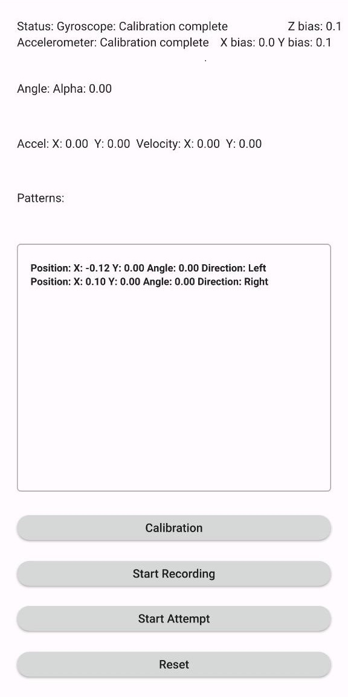

#### ScrollView
A ScrollView is a container that provides a scrollable area for its child elements, which is useful when you have content that exceeds the available space.
each `scrollView` has these properties: 
- Layout.fillWidth: Makes the label fill the available width.
- Layout.preferredHeight: Sets the preferred height of the label.
- TextArea: This is a multi-line text input field in QML. It's being used as the child element of the ScrollView.
    - id: This provides a unique identifier for the TextArea
    - wrapMode: This property determines how the text wraps within the TextArea. In this case, it wraps at word boundaries or anywhere if necessary.
    - font.pixelSize: This sets the size of the text displayed within the TextArea.
    - font.bold: set if we want the text to be bold or not.
    - readOnly: This property makes the TextArea read-only, meaning users can't edit its content directly.

```QML
        ScrollView {
            Layout.fillWidth: true
            Layout.preferredHeight: 200
            TextArea {
                id: outputArea
                wrapMode: TextArea.WrapAtWordBoundaryOrAnywhere
                font.pixelSize: 14
                font.bold: true
                readOnly: true
            }
        }
```
in the above picture, you have seen the `scrollView` and its inside text. Whenever one pattern is captured this text will be updated and one pattern will be appended.

#### Button 
A Button is an interactive component that users can click to trigger actions.
each button has these properties: 
- id: A unique identifier for the element.
- text: The label displayed on the button.
- Layout.fillWidth: Makes the button fill the available width.
- Layout.preferredHeight: Sets the preferred height of the button.
- onClicked: A signal handler that defines what happens when the button is clicked.

** Here we have 5 buttons:
```QML
        Button {
            id: calibration
            text: qsTr("Calibration")
            Layout.fillWidth: true
            Layout.preferredHeight: 41
            onClicked: {
                // Reset calibration status
                gyroCalibrated = false;
                accelCalibrated = false;
                gyroCalibrationMessage = "";
                accelCalibrationMessage = "";

                gyroscope.calibration();
                accelerometer.calibration();
            }
        }

        Button {
            id: startRecordingButton
            text: qsTr("Start Recording")
            Layout.fillWidth: true
            Layout.preferredHeight: 41
            onClicked: {
                if (text === "Start Recording") {
                    text = "Stop Recording"
                    accelerometer.start()
                    gyroscope.start()
                } else {
                    text = "Start Recording"
                    accelerometer.stop()
                    gyroscope.stop()
                    movementDatabase.createNewPattern(false)
                }
            }
        }

        Button {
            id: startAttemptButton
            text: qsTr("Start Attempt")
            Layout.fillWidth: true
            Layout.preferredHeight: 41
            onClicked: {
                if (text === "Start Attempt") {
                    text = "Stop Attempt"
                    accelerometer.start()
                    gyroscope.start()
                } else {
                    text = "Start Attempt"
                    accelerometer.stop()
                    gyroscope.stop()
                    movementDatabase.createNewPattern(true)
                }
            }
        }

        Button {
            id: resetButton
            text: qsTr("Reset")
            Layout.fillWidth: true
            Layout.preferredHeight: 41
            onClicked: {
                movementDatabase.reset();
                gyroscope.reset();
                // accelerometer.reset();
            }
        }
```
- calibration: when this button is clicked the calibration status will reset.
- startRecordingButton: the text on this button will shuffled whenever is clicked. if it was "Start Recording" by clicking it will become "Stop Recording". Also, accelerator and gyroscope sensors will start working. then when we click again on this button the text will change back to "Start Recording". Also, the accelerator and gyroscope sensors will stop working. and new pattern must be saved so we have called `createNewPattern` function. it is given "false" parameter indicates that this pattern should be added as a recoriding one not for authentication.
- startAttemptButton: the text on this button will shuffled whenever is clicked. if it was "Start Attempt" by clicking it will become "Stop Attempt". Also, accelerator and gyroscope sensors will start working. then when we click again on this button the text will change back to "Start Attempt". Also, the accelerator and gyroscope sensors will stop working. and new pattern must be saved so we have called `createNewPattern` function. but this time it is given "true" parameter indicates that this pattern should be added as an attemp one and should be authenticate and is not for being just recorded.
- resetButton: when this button is clicked our sensors will reset. and all the movements in `movementDatabase` will be deleted. 

## main entry to the project
```QML
int main(int argc, char *argv[])
{
    QGuiApplication app(argc, argv);

    qmlRegisterType<Accelerometer>("com.example", 1, 0, "Accelerometer");
    qmlRegisterType<Gyroscope>("com.example", 1, 0, "Gyroscope");
    qmlRegisterType<MovementDatabase>("com.example", 1, 0, "MovementDatabase");

    QQmlApplicationEngine engine;

    MovementDatabase movementDatabase;
    engine.rootContext()->setContextProperty("movementDatabase", &movementDatabase);

    const QUrl url(u"qrc:/QtQuickProject/Main.qml"_qs);
    QObject::connect(
        &engine,
        &QQmlApplicationEngine::objectCreationFailed,
        &app,
        []() { QCoreApplication::exit(-1); },
        Qt::QueuedConnection);

    engine.load(url);

    return app.exec();
}
```
main.cpp file is the main entry point for a Qt Quick application. It sets up the application, registers custom QML types, and loads the main QML file to start the application. <br/>
when we create a QtQuick project it will automatically generate this file with initial codes. So just need to add these parts:
```QML
    qmlRegisterType<Accelerometer>("com.example", 1, 0, "Accelerometer");
    qmlRegisterType<Gyroscope>("com.example", 1, 0, "Gyroscope");
    qmlRegisterType<MovementDatabase>("com.example", 1, 0, "MovementDatabase");
```
These lines of code are registering custom C++ classes with the QML type system. This allows these classes to be used directly in QML files. <br/>
Template Parameter (<T>): This specifies the C++ class we are registering. For example, `Accelerometer`, `Gyroscope`, and `MovementDatabase` in our case. <br/>
"com.example": This is the URI (Uniform Resource Identifier) of the module in which the type is registered. It acts like a namespace or module name in QML. As you see it is imported into .QML file. <br/>
1 and 0 are used for the version number of the module, the major and minor part. in this case, our version will be 1.0. <br/>
last parameter is the name by which the type will be known in QML. by this way we can instantiate and use objects of these types in our .QML file. <br/>
whenever we make a file (object) and we want to use that object in our QML file, by this way we can add it to our created module ("com.example").
```QML
    MovementDatabase movementDatabase;
    engine.rootContext()->setContextProperty("movementDatabase", &movementDatabase);
```
This makes the instance accessible in QML files under the name `movementDatabase`. Later we will observe and explain `movementDatabase`. 

## Accelerometer class
Accelerometer class is designed to interface with a QML application to handle accelerometer sensor readings. It provides functionality for starting and stopping the sensor, processing the sensor readings, applying a Kalman filter for noise reduction, handling calibration, and emitting relevant signals for use in a QML application. Here we explain each part of this class in detail:

### Constructor
```cpp
Accelerometer::Accelerometer(QObject *parent) : QObject(parent), x_bias(0.0), y_bias(0.0),
    xKalman(0.1, 1, 0.1, 0.0), yKalman(0.1, 1, 0.1, 0.0), velocity(0.0),velocityX(0.0), velocityY(0.0) // Initialize Kalman filters
{
    sensor = new QAccelerometer(this);
    timer = new QTimer(this);
    calibrationTimer = new QTimer(this);
    connect(timer, &QTimer::timeout, this, &Accelerometer::onSensorReadingChanged);
    connect(calibrationTimer, &QTimer::timeout, this, &Accelerometer::onCalibrationFinished);
}
```
here we initialize member variables, including bias, Kalman filter, and velocities.
the reason that we have bias is that when we do calibration we check the base state of velocity of the cellphone. and we name this initial state as bias and when we want to calculate new velocities we should consider this bias as well. Kalman filter is for noise reduction. we will explain its algorithm later. but briefly, it reduce the noise by choosing to consider and rely more on the older data or newer ones. In this way, sudden short changes in velocity won't affect the result. for the velocity we have 3 kinds, one for x direction and the other for y direction and one of them is the general velocity. <br/>
these velocities will be calculated based on the acceleration and time by the formula: $a * t = delta v$ and we need to add it to the previous velocity to reach the new velocity. 
these velocities will be updated after each time interval. <br/>
then we make an instance of the available `QAccelerometer` sensor object. <br/>
we have two types of timers. One is for sampling intervals (timer) and the other (calibrationTimer) is for handling calibration. then we connect the timer signal to `onSensorReadingChanged` function. so whenever a timer reaches a specified time(we have specified the time intervals in this file in start method), and timeout occurs this function will be called. <br/>
also, we connect the `calibrationTimer` signal to  `onCalibrationFinished` function. so whenever this timer reaches a specified time(we have specified this time duration in calibration method), and timeout occurs this function will be called. <br/>
the reason that we have `calibrationTimer` is that for calculating the initial bias we should get many samples from the sensors in one period of time and calculate the average. thus for indicating the duration of this period we need to set a `calibrationTimer`.
### Destructor
```cpp
Accelerometer::~Accelerometer()
{
    stop();
    delete sensor;
}
```
Ensures that the sensor is stopped and deleted when the Accelerometer object is destroyed to clean up resources properly.
### Start method and Stop method
```cpp
void Accelerometer::start()
{
    if (!sensor->isActive())
    {
        sensor->start();
        timer->start(accel_sampling_interval);
        emit activeChanged();
        qDebug() << "Accelerometer started.";
    }
}

void Accelerometer::stop()
{
    if (sensor->isActive())
    {
        sensor->stop();
        timer->stop();
        calibrationTimer->stop();
        emit activeChanged();
        qDebug() << "Accelerometer stopped.";
    }
}
```
- start: Starts the accelerometer sensor and a timer to periodically read sensor data. Emits the activeChanged signal and logs the action.
- stop: Stops the accelerometer sensor and the timers. Emits the `activeChanged` signal and logs the action.
### Sensor Reading Handling
onSensorReadingChanged: Handles sensor readings when the timer times out.
```cpp
void Accelerometer::onSensorReadingChanged()
{
    QAccelerometerReading *reading = sensor->reading();
    if (reading)
    {
        qreal x = reading->x();
        qreal y = reading->y();

        // Apply Kalman filter
        x = xKalman.update(x);
        y = yKalman.update(y);

        // Adjust for bias
        if (std::abs(x) <= accel_threshold)
            x = 0.0;
        else
            x -= x_bias;

        if (std::abs(y) <= accel_threshold)
            y = 0.0;
        else
            y -= y_bias;

        if (x == 0 && y == 0) // frictional accel
        {
            QVector2D newVelocities = frictionalAccel(velocityX, velocityY);
            velocityX = newVelocities.x();
            velocityY = newVelocities.y();
        }

        velocityX += x * accel_sampling_interval / 1000;
        velocityY += y * accel_sampling_interval / 1000;

        QString output = QStringLiteral("X: %1  Y: %2  Velocity: X: %3  Y: %4")
                             .arg(QString::number(x, 'f', 2),
                                  QString::number(y, 'f', 2),
                                  QString::number(velocityX, 'f', 2),
                                  QString::number(velocityY, 'f', 2));
        emit readingUpdated(output);
        emit newAcceleration(x, y, velocityX, velocityY);
        //qDebug() << output;
    }
    else
    {
        qDebug() << "No reading available.";
    }
}
```
this function will be called after each time interval, first, we read the data from the accelerometer sensor. if there is data to read we do the following steps otherwise we log the appropriate message indicating that we have no data to read. then we extract the velocity of x and y from the read data. and update them by applying the Kalman algorithm for noise reduction. <br/>
we have a threshold for acceleration and whenever we are less than that threshold we consider the acceleration as zero. the reason is to set small values to zero to handle sensor noise. we've determined this variable by trial and error. 
so we check if the acceleration is less than that threshold or not. if not, we apply bias and reach the actual acceleration. 
```cpp
        if (x == 0 && y == 0) // frictional accel
        {
            QVector2D newVelocities = frictionalAccel(velocityX, velocityY);
            velocityX = newVelocities.x();
            velocityY = newVelocities.y();
        }
```
here we consider friction force and simulate it. if we weren't considering this force, when the acceleration becomes zero, it will assume that henceforward we have a constant, not zero velocity. but in reality, we have friction force which will reduce the velocity until it becomes zero and stops. so in this code is checked if our acceleration is zero or not, if yes, we call the `frictionalAccel` function. we will explain about this function later. it will handle how the velocity should be reduced. then it returns new velocities.
```cpp
        velocityX += x * accel_sampling_interval / 1000;
        velocityY += y * accel_sampling_interval / 1000;
```
here we update our velocities in both directions. To do this, we multiply the current velocities by time intervals to reach delta v. Then we add it to previous velocities (division by 1000 is for that our unit for time is mili second so we should convert it to second).
```cpp
        QString output = QStringLiteral("X: %1  Y: %2  Velocity: X: %3  Y: %4")
                             .arg(QString::number(x, 'f', 2),
                                  QString::number(y, 'f', 2),
                                  QString::number(velocityX, 'f', 2),
                                  QString::number(velocityY, 'f', 2));
        emit readingUpdated(output);
        emit newAcceleration(x, y, velocityX, velocityY);
```
here we can see the format of the output that will be shown on the screen of our application which shows the accelerations and velocities.
at the end, we emit signals with the updated values for use in the QML frontend.
we will discuss these signals later. but briefly `newAcceleration` signal will handle our movements (check if we have finished one movement or not yet in order to add it to our movement database). the connection of this signal can be seen in .QML file. <br/>
`readingUpdated` signal is emitted to handle what should be shown on the screen. 
### Frictional Acceleration Calculation
frictionalAccel: Simulates frictional deceleration on the velocities to gradually bring them to zero when no acceleration is detected.
```cpp
QVector2D Accelerometer::frictionalAccel(qreal velocityX, qreal velocityY)
{
    qreal frictionalDecay = accel_threshold * accel_sampling_interval / 1000;

    if (velocityX > 0) // If velocityX is positive
    {
        velocityX -= frictionalDecay;
        if (velocityX < 0) // Ensure velocity doesn't go negative
            velocityX = 0;
    }
    else if (velocityX < 0) // If velocityX is negative
    {
        velocityX += frictionalDecay;
        if (velocityX > 0) // Ensure velocity doesn't go positive
            velocityX = 0;
    }

    if (velocityY > 0) // If velocityY is positive
    {
        velocityY -= frictionalDecay;
        if (velocityY < 0) // Ensure velocity doesn't go negative
            velocityY = 0;
    }
    else if (velocityY < 0) // If velocityY is negative
    {
        velocityY += frictionalDecay;
        if (velocityY > 0) // Ensure velocity doesn't go positive
            velocityY = 0;
    }

    return QVector2D(velocityX, velocityY);
}
```
this function will get the current velocities in both directions. then first calculate by which rate it should reduce the velocity. To calculate this, we multiply an assumed acceleration of friction by the time intervals to reach delta v. This way, we have a decay rate(division by 1000 is for that our unit for time is mili second, so we should convert it to second). in the conditional statements, we check if our velocities in each direction is positive or not. for example, if our velocity in x direction is positive it means that we should reduce it and subtract the frictionDecay from the velocity. after that, we will check if the velocity goes under zero or not. if yes, we consider the new velocity as zero. for other cases accordingly we apply this approach.

### Calibration Methods
```cpp
void Accelerometer::calibration()
{
    sensor->start();
    x_values.clear();
    y_values.clear();
    calibrationTimer->start(calibrationDuration);
    connect(sensor, &QAccelerometer::readingChanged, this, &Accelerometer::onCalibrationReadingChanged);
}
```
calibration: Starts the sensor and prepares for calibration by clearing previous values and starting a timer for the calibration duration. from this time we connect `onCalibrationReadingChanged` function to the `readingChanged` signal. it says that for the calibration process, we will manually emit a reading data signal to read data from the sensor in time intervals. instead, the `readingChanged` signal will be automatically emitted whenever new data is available to read on the sensor. 
```cpp
void Accelerometer::onCalibrationReadingChanged()
{
    QAccelerometerReading *reading = sensor->reading();
    if (reading)
    {
        x_values.append(reading->x());
        y_values.append(reading->y());
    }
    else
    {
        qDebug() << "No reading available.";
    }
}
```
this function will be called whenever `readingChanged` signal is emitted. then it will read data from the sensor and append current accelerations to an array of accelerator's history. (we will need these accelerations during the `calibrationDuration` to calculate bias)
```cpp
void Accelerometer::onCalibrationFinished()
{
    sensor->stop();
    calibrationTimer->stop();
    disconnect(sensor, &QAccelerometer::readingChanged, this, &Accelerometer::onCalibrationReadingChanged);

    double x_sum = 0.0;
    double y_sum = 0.0;

    for (double x : x_values)
        x_sum += x;

    for (double y : y_values)
        y_sum += y;

    x_bias = x_sum / x_values.size();
    y_bias = y_sum / y_values.size();

    QString output = QStringLiteral("Calibration complete\tX bias: %1 Y bias: %2")
                         .arg(QString::number(x_bias, 'f', 1),
                              QString::number(y_bias, 'f', 1));
    qDebug() << "Biases: " + output;

    emit calibrationFinished(output);
}
```
this function will be called when the timer of the calibration is timeout. then we will stop the sensor from reading. and stop the timer as well(because we just want to calibrate a single time). then disconnect `readingChanged` signal because henceforward we don't want to read data from the sensor whenever new data is available instead we want to read data by time intervals and get samples periodically.<br/>
in this function, we calculate bias by calculating the average of the velocities we have saved in history during the `calibrationDuration`. at the end, we specify the format of output which will be shown on the screen. then we emit `calibrationFinished` signal indicates that calibration is complete and provides the calibration result. whenever this signal is emitted we will show the output on the screen of our application.

## Gyroscope class
The Gyroscope class in the provided code is designed to handle the operations of a gyroscope sensor within a Qt application. The class uses the `QGyroscope` sensor to read gyroscope data, applies Kalman filtering to the sensor data, performs calibration to determine sensor biases, and emits signals for use in the QML frontend.
### Constructor
```cpp
Gyroscope::Gyroscope(QObject *parent)
    : QObject(parent), z_bias(0.0), currentAngle(0.0), angleKalman(0.1, 1, 0.1, 0.0) // Initialize Kalman filter
{
    sensor = new QGyroscope(this);
    timer = new QTimer(this);
    calibrationTimer = new QTimer(this);
    connect(timer, &QTimer::timeout, this, &Gyroscope::onSensorReadingChanged);
    connect(calibrationTimer, &QTimer::timeout, this, &Gyroscope::onCalibrationFinished);
}
```
here we initialize member variables, including bias, Kalman filter, and the angle.<br/>
note that we consider just one angle in z direction.<br/>
the reason that we have bias is that when we do calibration we check the base state of the angle of the cellphone. and we name this initial state as bias and when we want to calculate a new angle we should consider this bias as well. Kalman filter is for noise reduction. we will explain its algorithm later.<br/>
the angle will be updated after each time interval. <br/>
then we make an instance of the available `QGyroscope` sensor object. <br/>
here like Accelormeter, we have two types of timers. One is for sampling intervals (timer) and the other (calibrationTimer) is for handling calibration. then we connect the timer signal to `onSensorReadingChanged` function. so whenever a timer reaches a specified time(we have specified the time intervals in this file in start method), and timeout occurs this function will be called. <br/>
also, we connect the `calibrationTimer` signal to  `onCalibrationFinished` function. so whenever this timer reaches a specified time(we have specified this time duration in calibration method), and timeout occurs, this function will be called. <br/>
the reason that we have `calibrationTimer` is that for calculating the initial bias we should get many samples from the sensors in one period of time and calculate the average. thus to indicate the duration of this period we need to set a `calibrationTimer`.

### Destructor
```cpp
Gyroscope::~Gyroscope()
{
    stop();
    delete sensor;
}
```
Ensures that the sensor is stopped and deleted when the Gyroscope object is destroyed to clean up resources properly.

### Start method and Stop method
```cpp
void Gyroscope::start()
{
    if (!sensor->isActive())
    {
        currentAngle = 0.0; // reset it
        sensor->start();
        timer->start(gyro_sampling_interval);
        emit activeChanged();
        qDebug() << "Gyroscope started.";
    }
}

void Gyroscope::stop()
{
    if (sensor->isActive())
    {
        sensor->stop();
        timer->stop();
        calibrationTimer->stop();
        emit activeChanged();
        qDebug() << "Gyroscope stopped.";
    }
}
```
- start: Starts the gyroscope sensor and a timer to periodically read sensor data. Emits the activeChanged signal and logs the action.
- stop: Stops the accelerometer sensor and the timers. Emits the `activeChanged` signal and logs the action.

### Calibration Methods
```cpp
void Gyroscope::calibration()
{
    sensor->start();
    z_values.clear();
    calibrationTimer->start(calibrationDuration);
    connect(sensor, &QGyroscope::readingChanged, this, &Gyroscope::onCalibrationReadingChanged);
}
```
calibration: Starts the sensor and prepares for calibration by clearing previous values and starting a timer for the calibration duration. from this time we connect `onCalibrationReadingChanged` function to the `readingChanged` signal. it says that for the calibration process, we will manually emit a reading data signal to read data from the sensor in time intervals. instead, the `readingChanged` signal will be automatically emitted whenever new data is available to read on the sensor. 
```cpp
void Gyroscope::onCalibrationReadingChanged()
{
    QGyroscopeReading *reading = sensor->reading();
    if (reading)
    {
        z_values.append(reading->z());
    }
    else
    {
        qDebug() << "No reading available.";
    }
}
```
this function will be called whenever `readingChanged` signal is emitted. then it will read data from the sensor and append current angular velocity to an array of angular velocities history. (we will need these angles during the `calibrationDuration` to calculate bias)
```cpp
void Gyroscope::onCalibrationFinished()
{
    sensor->stop();
    calibrationTimer->stop();
    disconnect(sensor, &QGyroscope::readingChanged, this, &Gyroscope::onCalibrationReadingChanged);

    double z_sum = 0.0;
    for (double z : z_values)
        z_sum += z;

    z_bias = z_sum / z_values.size();

    QString output = QStringLiteral("Calibration complete\tZ bias: %1")
                         .arg(QString::number(z_bias, 'f', 1));
    qDebug() << "Bias: " + output;

    emit calibrationFinished(output);
}
```
this function will be called when the timer of the calibration is timeout. then we will stop the sensor from reading. and stop the timer as well(because we just want to calibrate a single time). then disconnect `readingChanged` signal because henceforward we don't want to read data from the sensor whenever new data is available instead we want to read data by time intervals and get samples periodically.<br/>
in this function, we calculate bias by calculating the average of the angular velocities we have saved in history during the `calibrationDuration`. at the end, we specify the format of output which will be shown on the screen. then we emit `calibrationFinished` signal indicates that calibration is complete and provides the calibration result. whenever this signal is emitted we will show the output on the screen of our application.

### Sensor Reading Handling
```cpp
void Gyroscope::onSensorReadingChanged()
{
    QGyroscopeReading *reading = sensor->reading();
    if (reading)
    {
        double alpha = reading->z();

        // Apply Kalman filter
        alpha = angleKalman.update(alpha);

        // Adjust for bias
        alpha -= z_bias;

        // Apply threshold
        if (std::abs(alpha) < gyro_threshold)
            alpha = 0.0;

        double angleChange = alpha * 0.01;
        currentAngle += angleChange;


        if (currentAngle >= 360.0) currentAngle -= 360.0;
        if (currentAngle < 0.0) currentAngle += 360.0;

        // Normalize the angle change
        double normalizedAngle = 0.0;
        if (currentAngle >= 60.0 && currentAngle < 135.0) {
            normalizedAngle = 90.0;
        } else if (currentAngle >= 135.0 && currentAngle < 225.0) {
            normalizedAngle = 180.0;
        } else if (currentAngle >= 225.0 && currentAngle < 315.0) {
            normalizedAngle = -90.0;
        } else {
            normalizedAngle = 0.0;
        }

        QString output = QStringLiteral("Alpha: %1").arg(QString::number(normalizedAngle, 'f', 2));

        emit readingUpdated(output);
        emit newRotation(normalizedAngle);

    }
    else
    {
        qDebug() << "No reading available.";
    }
}
```
this function will be called after each time interval, first, we read the data from the gyroscope sensor. if there is data to read we do the following steps otherwise we log the appropriate message indicating that we have no data to read. then we extract the angular velocity in the z-direction from the read data. and update it by applying the Kalman algorithm for noise reduction. <br/>
then we apply bias. and then check if our current angular velocity is less than a threshold or not.
we have a threshold for angular velocity and whenever we are less than that threshold we consider the velocity as zero. the reason is to set small values to zero to handle sensor noise. we've determined this threshold variable by trial and error. </br>
```cpp
        double angleChange = alpha * 0.01;
        currentAngle += angleChange;
```
here we update our angular velocity. To do this, we multiply the current angular velocity by time intervals to reach delta v. Then we add it to the previous angular velocity.

```cpp
        if (currentAngle >= 360.0) currentAngle -= 360.0;
        if (currentAngle < 0.0) currentAngle += 360.0;

        // Normalize the angle change
        double normalizedAngle = 0.0;
        if (currentAngle >= 60.0 && currentAngle < 135.0) {
            normalizedAngle = 90.0;
        } else if (currentAngle >= 135.0 && currentAngle < 225.0) {
            normalizedAngle = 180.0;
        } else if (currentAngle >= 225.0 && currentAngle < 315.0) {
            normalizedAngle = -90.0;
        } else {
            normalizedAngle = 0.0;
        }
```
here we normalize the angel. our valid angels are 0, 90, 180, -90. so we try to normalize the angle to reach these valid angles.
```cpp
        QString output = QStringLiteral("Alpha: %1").arg(QString::number(normalizedAngle, 'f', 2));

        emit readingUpdated(output);
        emit newRotation(normalizedAngle);
```
here we can see the format of the output that will be shown on the screen of our application which shows the angle.
at the end, we emit signals with the updated values for use in the QML frontend.
we will discuss these signals later. but briefly `newRotation` signal will handle our movements (check if we have finished one movement or not yet to add it to our movement database). the connection of this signal can be seen in .QML file. <br/>
`readingUpdated` signal is emitted to handle what should be shown on the screen. 

### Reset Method
```cpp
void Gyroscope::reset()
{
    //z_bias = 0.0;
    currentAngle = 0.0;
    //angleKalman.reset(0.0);
    qDebug() << "Gyroscope reset.";
}
```
reset: Resets the current angle to 0 and logs the action.
## Movement class
The Movement class in the provided code is designed to handle movement calculations based on accelerometer data and angular changes. It computes distances traveled in X and Y directions, updates the current position and angle, and determines the movement direction.
### Constructor
```cpp
Movement::Movement(QObject *parent)
    : QObject(parent), sampleInterval(0.01), currentAngle(0.0) // assuming a sample interval of 0.05 seconds
{
}
```
this constructor initializes member variables including the sample interval and the current angle. it must have the attribute of `samleInterval` the reason is that we need it to calculate the traveled distance.
### Adding Acceleration and Angle Data
```cpp
void Movement::addAcceleration(double x, double y)
{
    accelerations.append(QVector3D(x, y, 0.0));
}

void Movement::addAngleChange(double alpha)
{
    angleChanges.append(alpha);
    currentAngle = alpha;
}
```
- addAcceleration: Adds a new acceleration vector to the `accelerations` list. we need to save acceleration in each time interval because we need them to calculate the traveled distance.
- addAngleChange: Adds a new angular change to the `angleChanges` list and updates the current angle (`currentAngle`).

### Distance Calculation
```cpp
qreal Movement::calculateDistanceTraveled() const
{
    qreal totalDistance = 0.0;
    qreal velocityX = 0.0;
    qreal velocityY = 0.0;
    qreal previousVelocityX = 0.0;
    qreal previousVelocityY = 0.0;
    for (const QVector3D &acceleration : accelerations) {
        velocityX += acceleration.x() * sampleInterval;
        velocityY += acceleration.y() * sampleInterval;

        qreal averageVelocityX = (previousVelocityX + velocityX) / 2;
        qreal averageVelocityY = (previousVelocityY + velocityY) / 2;

        qreal distanceX = averageVelocityX * sampleInterval;
        qreal distanceY = averageVelocityY * sampleInterval;

        totalDistance += std::sqrt(distanceX * distanceX + distanceY * distanceY);

        previousVelocityX = velocityX;
        previousVelocityY = velocityY;
    }
    //qDebug() << totalDistance;
    return totalDistance;
}
```
in this function, we want to calculate the distance we have traveled till now in one movement. To do this we use this formula: $((v1 + v2)/2)*t$  in this formula we assume that acceleration is constant in one sampling interval.<br/>
this function does these steps:
- Iterates over each acceleration vector, updating the velocities: from the beginning of the movement start to calculate what a velocity is in each time interval.
- Calculates the distance in each direction by the mentioned formula.
- Sums up the distances to get the total distance traveled. (the total distance is calculated by the formula: $\sqrt{x^2+y^2}$
- update the previous velocity with the current one and then go through another iteration.
### Setting Start Position and Angle
```cpp
void Movement::setStartPosition(qreal x, qreal y)
{
    startPosition = QVector3D(x, y, 0.0);
}

void Movement::setStartAngle(qreal angle)
{
    currentAngle = angle;
}
```
Sets the starting position and angle of the movement. we need them because when a new movement is created it will get the start position from the last position of the previous movement. 
- this function is called when a new movement is added to our `movementDatabase`.
### Distance Calculation in X and Y Directions separately
```cpp
qreal Movement::calculateDistanceTraveledX() const
{
    qreal totalDistance = 0.0;
    qreal velocityX = 0.0;
    qreal previousVelocityX = 0.0;
    for (const QVector3D &acceleration : accelerations) {
        velocityX += acceleration.x() * sampleInterval;

        qreal averageVelocityX = (previousVelocityX + velocityX) / 2;

        qreal distanceX = averageVelocityX * sampleInterval;

        totalDistance += distanceX;

        previousVelocityX = velocityX;
    }
    return totalDistance;
}

qreal Movement::calculateDistanceTraveledY() const
{
    qreal totalDistance = 0.0;
    qreal velocityY = 0.0;
    qreal previousVelocityY = 0.0;
    for (const QVector3D &acceleration : accelerations) {
        velocityY += acceleration.y() * sampleInterval;

        qreal averageVelocityY = (previousVelocityY + velocityY) / 2;

        qreal distanceY = averageVelocityY * sampleInterval;

        totalDistance += distanceY;

        previousVelocityY = velocityY;
    }
    return totalDistance;
}
```
in these functions, we want to calculate the distance in the x and y direction separately which we have traveled till now in one movement. To do this we use this formula: $((v1 + v2)/2)*t$ <br/>

### Current Position Calculation
```cpp
QVector3D Movement::getCurrentPosition() const
{
    qreal distanceTraveledX = calculateDistanceTraveledX();
    qreal distanceTraveledY = calculateDistanceTraveledY();
    QVector3D currentPosition = startPosition;
    if (currentAngle == 0)
    {
        currentPosition.setX(startPosition.x() + distanceTraveledX);
        currentPosition.setY(startPosition.y() + distanceTraveledY);
    }
    else if (currentAngle == 90)
    {
        currentPosition.setX(startPosition.x() - distanceTraveledY);
        currentPosition.setY(startPosition.y() + distanceTraveledX);
    }
    else if (currentAngle == -90)
    {
        currentPosition.setX(startPosition.x() + distanceTraveledY);
        currentPosition.setY(startPosition.y() - distanceTraveledX);
    }
    else if (currentAngle == 180)
    {
        currentPosition.setX(startPosition.x() - distanceTraveledX);
        currentPosition.setY(startPosition.y() - distanceTraveledY);
    }

    currentPosition.setZ(0.0);
    qDebug() << "New starting position:";
    qDebug() << currentPosition;
    return currentPosition;
}
```
- Calculates the current position based on the starting position, distance traveled in X and Y directions, and the current angle.
- Adjusts the X and Y coordinates based on the current angle.
- Logs and returns the new position.
  ** We should note that when for example our angle is 90, when we push the cellphone to the right it gets negative acceleration in the y direction not positive acceleration in the x direction! so we should calculate the traveled distance in the y direction and subtract it from our x position to reach the current position. for each of these conditions, we have analyzed the attitude and accordingly applied this scenario.
### Current Angle
```cpp
double Movement::getCurrentAngle() const
{
    return currentAngle;
}
```
Returns the current angle.
### Finding Direction
this function is used to determine the direction of our movement. 
```cpp
void Movement::findDirection()
{
    qreal distanceX = calculateDistanceTraveledX();
    qreal distanceY = calculateDistanceTraveledY();
    bool main_direction_is_X = std::abs(distanceX) > std::abs(distanceY);
    qreal angle = getCurrentAngle();
    QString direction = "Not assigned";
    //logic

    if(main_direction_is_X && distanceX > 0)
    {
        if(angle == 0)
            direction = "Right";
        else if(angle == 90)
            direction = "Up";
        else if(angle == -90)
            direction = "Bottom";
        else if(angle == 180)
            direction = "Left";
    }
    else if(main_direction_is_X && distanceX < 0)
    {
        if(angle == 0)
            direction = "Left";
        else if(angle == 90)
            direction = "Bottom";
        else if(angle == -90)
            direction = "Up";
        else if(angle == 180)
            direction = "Right";
    }
    if(!main_direction_is_X && distanceY > 0)
    {
        if(angle == 0)
            direction = "Up";
        else if(angle == 90)
            direction = "Left";
        else if(angle == -90)
            direction = "Right";
        else if(angle == 180)
            direction = "Down";
    }
    else if(!main_direction_is_X && distanceY < 0)
    {
        if(angle == 0)
            direction = "Down";
        else if(angle == 90)
            direction = "Right";
        else if(angle == -90)
            direction = "Left";
        else if(angle == 180)
            direction = "Up";
    }
    currentDirection = direction;
}
```
findDirection: Determines the main direction of movement based on the distance traveled in X and Y directions and the current angle.
- Compares distances to determine if the main direction is along the X or Y.
- Uses the current angle to determine the correct direction string ("Right", "Left", "Up", "Down").
- Sets `currentDirection` based on these calculations.
### Getting Direction
```cpp
QString Movement::getDirection() const
{
    return currentDirection;
}
```
Returns the current direction string.
## movementDatabase class
this class is responsible for managing and tracking movements. It processes incoming acceleration and angle data, manages movements, and handles the creation of new movements and patterns.
### Constructor
```cpp
#define min_distance 0.2
MovementDatabase::MovementDatabase(QObject *parent)
    : QObject(parent), currentMovement(new Movement(this))
{
    m_movements.append(currentMovement);
}
```
on the top, we defined a minimum distance threshold (min_distance) of 0.2 units for creating a new movement.
then we initialize the `MovementDatabase` object.
then Create a new Movement object (`currentMovement`) and add it to the list of movements (`m_movements`).

### Handling New Acceleration
```cpp
void MovementDatabase::handleNewAcceleration(double x, double y, double velocityX, double velocityY, double xBias, double yBias)
{
    if (std::abs(x) <= min_acceleration && std::abs(y) <= min_acceleration && (std::abs(velocityX) <= min_velocity && std::abs(velocityY) <= min_velocity))
    {
        if(currentMovement->calculateDistanceTraveled() >= min_distance)
        {
            createNewMovement();
            qDebug() << "Creating new movements";
        }
        else if(currentMovement->calculateDistanceTraveled() < min_distance && currentMovement->calculateDistanceTraveled() > 0.0)
        {
            currentMovement->accelerations.clear();
            currentMovement->angleChanges.clear(); // no need to store because the movement was rotation
            qDebug() << "Movement cleared";
        }

    }

    if (std::abs(x) >= min_acceleration || std::abs(y) >= min_acceleration) {
        currentMovement->addAcceleration(x, y);
    }
    //qDebug() << m_movements;
}
```
this function checks if a movement is finished or not yet. one term is that the acceleration in both the x and y directions should be zero. another term is that the velocity in both directions should be zero too. but here instead of zero, we consider a min threshold and whenever those mentioned parameters are less than that threshold we conclude that one movement is finished. now this movement can be angular or distance. so we check if the traveled distance is more than a min threshold for distance, then we have a new movement for distance so we create and save a new movement. otherwise, we have angular movement but there is no need to store it because the movement was rotation. <br/>
otherwise, if we have acceleration more than that threshold, we will add it to the vector of accelerations of the current unfinished movement. 
### Handling New Angle
```cpp
void MovementDatabase::handleNewAngle(double alpha)
{
    currentMovement->addAngleChange(alpha);
    emit angleUpdated(currentMovement->getCurrentAngle());
}
```
- Adds the angle change to the current movement (add it to the vector of angular velocities of this unfinished movement).
- Emits a signal to update the angle by the current angle.
###  Resetting the Database
```cpp
void MovementDatabase::reset()
{
    currentMovement = new Movement(this);
    m_movements.clear();
    m_movements.append(currentMovement);
    //emit movementsUpdated(0.0, 0.0, 0.0, "Reset");
    qDebug() << "MovementDatabase reset.";
}
```
- Resets the movement database.
- Clears the list of movements and creates a new current movement as just initialization.

### Creating a New Movement
```cpp
void MovementDatabase::createNewMovement()
{
    QVector3D lastPosition;
    qreal lastAngle;
    Movement* newMovement = new Movement(this);
    Movement* lastMovement = m_movements.last();
    newMovement->setStartPosition(0.0, 0.0);
    newMovement->setStartAngle(0.0);
    lastPosition = QVector3D(0.0, 0.0, 0.0);
    lastAngle = 0.0;
    if (!m_movements.isEmpty()) {
        lastMovement->findDirection();
        lastPosition = lastMovement->getCurrentPosition();
        lastAngle = lastMovement->getCurrentAngle();
        newMovement->setStartPosition(lastPosition.x(), lastPosition.y());
        newMovement->setStartAngle(lastAngle);
    }
    emit movementsUpdated(lastPosition.x(), lastPosition.y(), lastAngle, lastMovement->getDirection());
    m_movements.append(newMovement);
    currentMovement = newMovement;
}
```
- Creates a new movement and sets its starting position and angle.
- Retrieves the position and angle of the last movement to set as the start for the new movement.
- Emits a signal to update movement data.
- Adds the new movement to the list and sets it as the current movement.
### Creating a New Pattern
```cpp
void MovementDatabase::createNewPattern(bool isAttempt)
{
    // Create a new Pattern instance with the current list of movements
    Pattern* pattern = new Pattern(m_movements, this);

    if(!isAttempt)
        emit newPattern(pattern);
    else
        emit newAttempt(pattern);

    // Optionally, clear the current list of movements if needed
    reset();
}
```
one parameter is given to this method which indicates that this method is called by clicking on `startRecordingButton` or `startAttemptButton`.
- Creates a new Pattern from the list of movements.
- Depending on whether it is an attempt, emits the appropriate signal (newPattern or newAttempt).
- Resets the movement database.

## Pattern class
this class represents a sequence of Movement objects. The class provides functionality for pattern authentication (comparing one pattern to another) and serialization to JSON format.
### Constructor
```cpp
Pattern::Pattern(const QList<Movement*> &movements, QObject *parent)
    : QObject(parent), m_movements(movements)
{
}
```
The constructor initializes a `Pattern` object with a list of `Movement` objects (`m_movements`) and a parent QObject.
`m_movements` stores the sequence of movements that make up the pattern.

### Pattern Authentication
```cpp
bool Pattern::authenticate(Pattern *other) const
{
    if (m_movements.size() != other->m_movements.size())
        return false;

    for (int i = 0; i < m_movements.size() - 1; ++i) {
        Movement* m1 = m_movements[i];
        Movement* m2 = other->m_movements[i];

        if (std::abs(m1->getCurrentAngle() - m2->getCurrentAngle()) > 0.0)
            return false;
        if (m1->getDirection() != m2->getDirection())
            return false;
        QVector3D pos1 = m1->getCurrentPosition();
        QVector3D pos2 = m2->getCurrentPosition();

        if (std::abs(pos1.x() - pos2.x()) > LOCATION_THRESHOLD || std::abs(pos1.y() - pos2.y()) > LOCATION_THRESHOLD)
            return false;
    }

    return true;
}
```
here we want to authenticate the pattern so we should compare the current captured pattern with other patterns which had been saved. each pattern consists of some movements. in order to compare patterns first we check the number of movements in each pattern if not equal it means that they are not identical. <br/>
when two patterns are identical, they have these properties:
1. they must have same number of movements.
2. each movement of both patterns must be identical one to one accordingly:
   1. both movements should have the same angle.
   2. both movements should have the same direction.
   3. both movements should have the same traveled distance.


### JSON Serialization
```cpp
QJsonArray Pattern::toJson() const
{
    QJsonArray jsonArray;

    QVector3D previousEnd(0, 0, 0); // Initial start position (0, 0)

    for (int i = 0; i < m_movements.size() - 1; ++i) {
        Movement* movement = m_movements[i];
        QJsonObject movementJson;
        QJsonObject startJson;
        QJsonObject endJson;

        // Set the start position
        startJson["x"] = previousEnd.x();
        startJson["y"] = previousEnd.y();

        // Get the end position from the movement
        QVector3D endPos = movement->getCurrentPosition();
        endJson["x"] = endPos.x();
        endJson["y"] = endPos.y();

        // Set the direction and angle
        movementJson["start"] = startJson;
        movementJson["end"] = endJson;
        movementJson["direction"] = movement->getDirection();
        movementJson["angle"] = movement->getCurrentAngle();

        // Add the movement JSON to the array
        jsonArray.append(movementJson);

        // Update previousEnd for the next movement
        previousEnd = endPos;
    }
    qDebug() << jsonArray;

    return jsonArray;
}
```
this function is used to write and save our pattern in JSON format. we have a `movementJson` object which consists of `startJson`(contains x and y of the start position) and `endJson`(contains the last x and y position) objects. and also it have direction and angle fields too. 
## patterndatabase class
this class is designed to manage a collection of Pattern objects. It provides functionality to add new patterns, authenticate patterns against stored patterns, and save the patterns to a JSON file.
### Constructor
```cpp
PatternDatabase::PatternDatabase(QObject *parent)
    : QObject(parent)
{
}
```
Initializes a `PatternDatabase` object.

### Adding a Pattern
```cpp
void PatternDatabase::addPattern(Pattern *pattern)
{
    qDebug() << "Pattern created";
    patterns.append(pattern);
}
```
we have database of all patterns and here we add a pattern to that database.
### Authenticating a Pattern
```cpp
void PatternDatabase::authenticatePattern(Pattern *pattern)
{
    QString status = "failed";
    for (Pattern *storedPattern : patterns) {
        if (storedPattern->authenticate(pattern)) {
            status = "succeed";
        }
    }
    QString output = QStringLiteral("Authentication %1").arg(status);
    emit authenticationResult(output);
}
```
`authenticatePattern` method compares a given Pattern object against all stored patterns in the patterns list:
- Iterates through the stored patterns:
   - If a stored pattern matches the given pattern (using the authenticate method of Pattern), set the status to "succeed". which means we are successfully authenticated.
- Shows the result status of authentication on the screen of our application.
- Emits `authenticationResult` signal which indicates that the result of our authentication is ready to be shown on the screen.

### Saving Patterns to JSON
```cpp
void PatternDatabase::savePatternsToJson(const QString &fileName)
{
    QJsonArray jsonArray;

    for (Pattern *pattern : patterns) {
        jsonArray.append(pattern->toJson());
    }

    QJsonDocument jsonDoc(jsonArray);

    QString filePath = QStandardPaths::writableLocation(QStandardPaths::AppDataLocation) + "/" + fileName;
    QDir dir(QStandardPaths::writableLocation(QStandardPaths::AppDataLocation));
    if (!dir.exists()) {
        dir.mkpath(".");
    }

    QFile file(filePath);
    if (!file.open(QIODevice::WriteOnly)) {
        qWarning() << "Couldn't open save file:" << filePath;
        return;
    }

    file.write(jsonDoc.toJson(QJsonDocument::Indented));
    file.close();
    qDebug() << "File saved to:" << filePath;
}
```
this method saves all stored patterns to a JSON file.
here we create a QJsonArray to hold the JSON representation of all patterns. then iterate through the stored patterns and appends their JSON representation (obtained by `toJson` method of Pattern) to the jsonArray.
then we create a `QJsonDocument` from the jsonArray.
we have created this file in order to save the json format of our patterns in it. 

## Questions and Answers
1. Collect device data and perform Trace and Profile operations using the Perfetto tool. According to the guide of this tool and after collecting the data, answer the following questions.
- From the time a request to read data is given to a sensor until the data is received, what happened at the level of the operating system and how much time has passed? 
  
  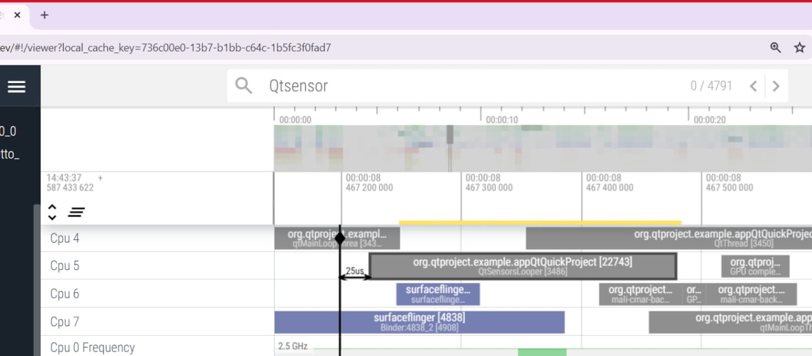
  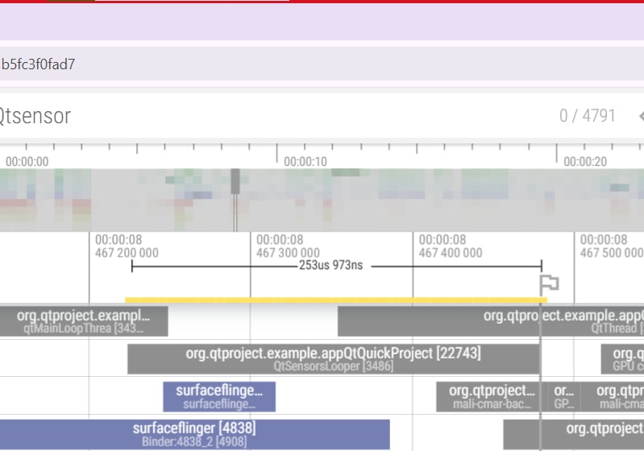
  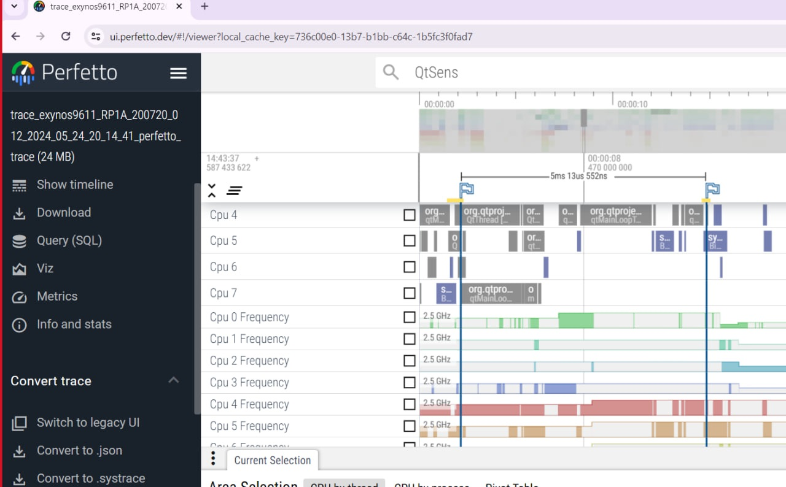
  
  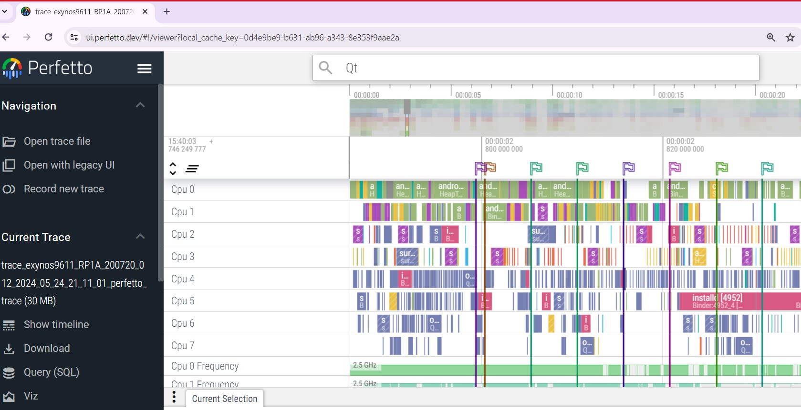
  
  From the time a request to read data is given to a sensor until the data is received, various operations occur at the level of the operating system (OS). This process involves multiple components of the OS and spans several microseconds, with other OS-related tasks happening concurrently among these sensor threads.
  
  The initial request to read data from the sensor is made by an application (e.g., org.qtproject.example.appQtQuickProject). At this point, the main thread (qtMainLoop) handles the request and schedules it for processing. This initial processing by the main thread takes about 253 microseconds. During this time, the OS manages the allocation of the request to the correct sensor, ensuring that all necessary permissions and protocols are followed.
  
  Once the main thread processes the request, it is passed to the sensor handler within the OS. The sensor then starts reading the data. This phase, where the sensor hardware fetches the required data, spans from 253 to 293 microseconds, taking approximately 40 microseconds. The sensor's internal processes convert the physical signal into a digital form that the system can interpret. Concurrently, the OS continues to handle other tasks, such as managing system resources, executing background processes, and handling interrupts, ensuring smooth operation and multitasking.
  
  After the sensor reads the data, it is sent back to the OS. Initially, a low-level driver (often part of the kernel) receives this data. The driver translates the raw sensor data into a format that higher-level processes can use. This phase involves receiving and processing the sensor data by the OS, which occurs between 293 and 333 microseconds, taking another 40 microseconds. During this period, other OS tasks also execute, including maintaining system stability and handling other I/O operations.
  
  Finally, the processed data is handed over to the application that requested it. The OS scheduler allocates CPU time to the application to handle the incoming data, ensuring that the application receives the data accurately and efficiently. Meanwhile, the OS continues to juggle other tasks, such as updating system logs, managing memory, and ensuring that other applications and services run smoothly.
  
  In summary, from the time the request is made until the data is received, the process involves several steps: initial request processing (253 microseconds), sensor data handling (40 microseconds), and data reception and final delivery (40 microseconds). The total time elapsed is 333 microseconds. Throughout this process, the OS plays a crucial role in scheduling, managing permissions, and handling data transfers between the application and the sensor. Additionally, the OS executes other related tasks concurrently, ensuring efficient multitasking and system stability.

- Compare the time between reading two consecutive data from the sensor in Perfetto with the sampling period you configured in your code.
  
  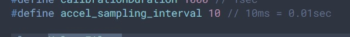
  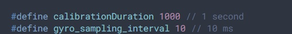
  

    The QtSensor system is designed to activate every 5 milliseconds, managing both the accelerometer and gyroscope sensors. This frequent activation ensures that the sensors are constantly providing up-to-date data, critical for applications requiring high precision and real-time feedback. By operating at this interval, the system can detect even the slightest changes in movement and orientation, enhancing the accuracy of measurements.
    
    Interestingly, the QtSensor's operation includes a broader cycle where these sensors are called approximately every 10 seconds. Initially, both the accelerometer and gyroscope are activated simultaneously, allowing for synchronized data collection. This simultaneous activation provides a comprehensive snapshot of the device's movement and orientation, which is crucial for applications like motion tracking and navigation.
    
    However, after the initial synchronization, the system introduces a staggered activation pattern. About 5 seconds after the first simultaneous call, there is a noticeable gap before one of the sensors is activated again. This pattern ensures that there is a periodic and alternating activation of the sensors, which can help in managing power consumption and processing loads more effectively. By spacing out the activations, the system maintains a balanced and efficient operation while still delivering frequent and accurate sensor data.
    
    Overall, the structured timing and activation strategy of the QtSensor system are designed to optimize both performance and resource management, ensuring reliable and efficient sensor data collection for any application relying on accelerometer and gyroscope inputs.
  
- In system calls, is there a conflict (waiting busy for a Thread until another Thread finishes its work) between processes (for example, using the library related to graphics) and updating the sensors? Justify your answer.
  
  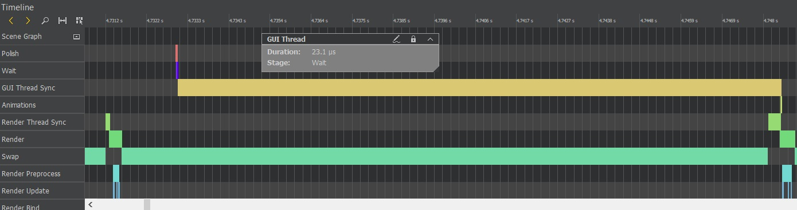
  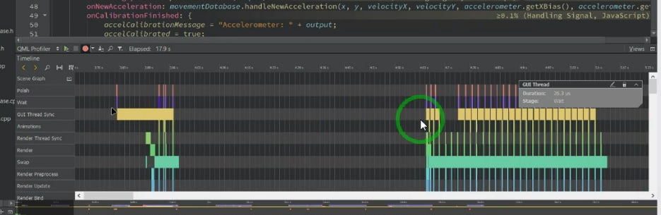
  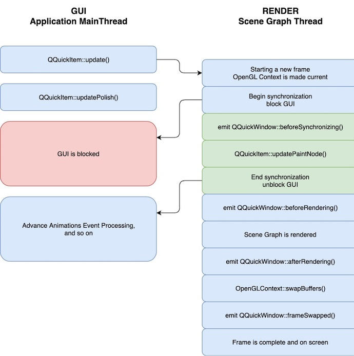
  
  Following the scene graph update, synchronization threads come into play, weaving together the diverse threads of user input, rendering, and system tasks. The GUI thread syncs with rendering to exchange vital information, while the render thread ensures data integrity before its spotlight moment. It's a backstage hustle, ensuring that every component is in place before the grand performance begins, with each thread playing its part in harmonizing the intricate dance between CPU and GPU, ultimately delivering a seamless visual experience.
  
- Compare the time needed to process sensor data with the time of other CPU processes.
  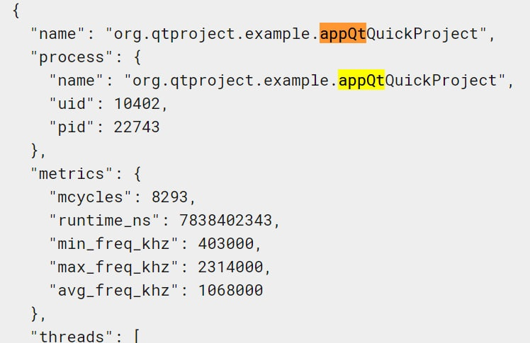
  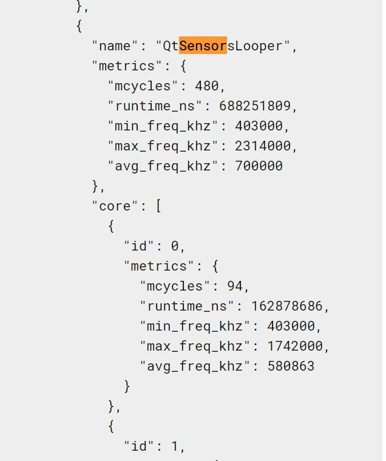
  Our program, org.qtproject.example.appQtQuickProject, executed for a total duration of 35 seconds. The breakdown of this runtime is as follows:

    + The main program of appQtQuickProject ran for 7 seconds.
    + The sensors within the program were active for 0.7 seconds.
  
  Analysis of Time Utilization
  
  It was observed that nearly 20% of the total execution time was consumed by the main program. The remaining 80% of the time was utilized by operating system (OS) tasks. This indicates a significant amount of time being spent on OS-related operations rather than the actual program execution.
  
  Given that the phone was in flight mode and no other applications were running, the expectation was that the majority of the processing time would be dedicated to our program. However, the data shows that only 20% of the time was dedicated to our program, suggesting inefficiencies in how our program runs on the operating system.
  
  While our program ran successfully for the specified duration, the analysis highlights that a significant portion of the time was lost to OS tasks. This inefficiency indicates that our program does not run optimally on the operating system. We will look into ways to optimize our program to enhance performance and reduce the time spent on OS operations.

1. When determining the best sampling interval for reading values from an accelerometer and a gyroscope, it's important to consider the nature and sensitivity of each sensor.

- Accelerometer: The impact of choosing the right sampling interval is more significant for the accelerometer compared to the gyroscope. Here’s why:

- Sensitivity to Sudden Vibrations: If the sampling interval is too small, the accelerometer may capture an excessive number of samples during sudden events, such as handshakes or minor vibrations. These sudden, high-frequency events are often noise and do not represent meaningful movement.
During these events, the captured samples are unreliable and can lead to incorrect calculations of traveled distance or changes in velocity. The sensor would report a large, erroneous change due to these high-frequency noises.
- Noise and Accuracy: if the sampling interval is too large, the accelerometer might miss capturing rapid changes in motion, leading to inaccurate data. Additionally, noise has a more significant impact when fewer samples are taken, as there are fewer data points to average out the noise.
A moderate sampling interval helps mitigate these issues by reducing the impact of both high-frequency noise and sudden events. It provides a balance, capturing enough data to be accurate without being overwhelmed by noise.
- Energy Consumption: Higher sampling rates consume more power, which is a critical consideration for battery-powered devices like cellphones. Finding the optimal interval is essential for maintaining battery life while ensuring data accuracy.

- Gyroscope: The gyroscope is less sensitive to the choice of sampling interval than the accelerometer, but it still benefits from an optimal interval:

- Rotational Precision: While not as susceptible to high-frequency noise, the gyroscope still requires a reasonable sampling rate to accurately capture the rotational motion. Too low a rate might miss quick turns or rotations.
- Data Consistency: Maintaining a consistent sampling interval ensures that the integration of angular velocity over time results in precise orientation tracking.
- Recommended Sampling Intervals
  - Accelerometer: A moderate sampling interval, typically around 50-100 Hz (10-20 ms), is often recommended. This range helps to capture meaningful motion data without being overly sensitive to high-frequency noise or vibrations.
  - Gyroscope: A slightly lower sampling rate, around 25-50 Hz (20-40 ms), is usually sufficient. This rate ensures accurate tracking of rotational movements without unnecessary data overhead.

3. Android devices have built-in sensors. Some of the sensors are hardware-based and some are software-based
sensors.
  - Hardware-based sensors are physical components built into a handset or tablet device and rely directly on the physical hardware of the device to collect sensor data. They derive their data by directly measuring specific environmental properties such as acceleration, geomagnetic field strength, or angular change. and are typically embedded within the device and function using electronic components such as accelerometers, gyroscopes, and magnetometers. 
  - Software-based sensors are not physical components and derive their data from one or more of the hardware-based sensors. These sensors usually utilize complex software algorithms to integrate data from different hardware sensors and produce useful information. Software-based sensors themselves do not have specific physical components but leverage the output of hardware sensors. The linear acceleration sensor and the gravity sensor are examples
of software-based sensors. <br/>
- in this project, we just had two sensors: an Accelerometer and a Gyroscope which both are hardware-based sensors.
<br/>
4. first let's discuss about these two types of sensors:
  - **Non-wake-up sensors**: Non-wake-up sensors are sensors that do not prevent the SoC from going into suspend mode and do not wake the SoC up to report data. In particular, the drivers are not allowed to hold wake-locks. It is the responsibility of applications to keep a partial wake lock should they wish to receive events from non-wake-up sensors while the screen is off. While the SoC is in suspend mode, the sensors must continue to function and generate events, which are put in a hardware FIFO. The events in the FIFO are delivered to the applications when the SoC wakes up. If the FIFO is too small to store all events, the older events are lost; the oldest data is dropped to accommodate the latest data. In the extreme case where the FIFO is nonexistent, all events generated while the SoC is in suspend mode are lost. One exception is the latest event from each on-change sensor: the last event must be saved outside of the FIFO so it cannot be lost. As soon as the SoC gets out of suspend mode, all events from the FIFO are reported and operations resume as normal.
    - briefly we can say these sensors wakes up the device's processor only if the application is actively monitoring sensor data. If the application is not actively listening for sensor updates, the device remains in a low-power state.
    - **Advantages**:
      1. Power Efficiency: Reduces power consumption by minimizing unnecessary wake-ups when the application is not actively using sensor data.
      2. Selective Wake-up: Allows the device to conserve power by waking up the processor only when sensor data is needed.
    - **Disadvantages**:
      1. Delayed Processing: May introduce delays in processing sensor data, especially if the application needs to wake up the processor first before receiving updates.
      2. Potential Latency: In scenarios where immediate response is crucial, there might be a slight delay in receiving sensor updates.
  - **Wake-up sensors**: In opposition to non-wake-up sensors, wake-up sensors ensure that their data is delivered independently of the state of the SoC. While the SoC is awake, the wake-up sensors behave like non-wake-up-sensors. When the SoC is asleep, wake-up sensors must wake up the SoC to deliver events. They must still let the SoC go into suspend mode, but must also wake it up when an event needs to be reported. That is, the sensor must wake the SoC up and deliver the events before the maximum reporting latency has elapsed or the hardware FIFO gets full.
    - briefly we can say wake-up sensors are those that wake up the device's processor when new sensor data is available. This means that even when the device is in a low-power state or sleeping mode, these sensors can trigger the device to wake up and process the new data.
    - **Advantages**:
      1. Real-Time Responsiveness: Allows for immediate processing of sensor data, leading to real-time responsiveness in applications.
      2. Timely Updates: Ensures that sensor data is promptly available for processing, reducing latency.
    - **Disadvantages**:
      1. Power Consumption: May consume more power as they can wake up the device frequently, potentially impacting battery life.
      2. Background Activity: Continuous wake-ups may lead to unnecessary background activity, affecting overall system efficiency.

- **Impact on Sensor Update and Movement Pattern Detection**: With wake-up sensors, the device can quickly receive sensor updates, leading to more responsive movement pattern detection. However, this may come at the cost of increased power consumption. but with non wake-up sensors may have slight delays in receiving sensor updates, potentially impacting the responsiveness of movement pattern detection, especially in real-time applications. 


## Test Application

### Up and Left without rotation 

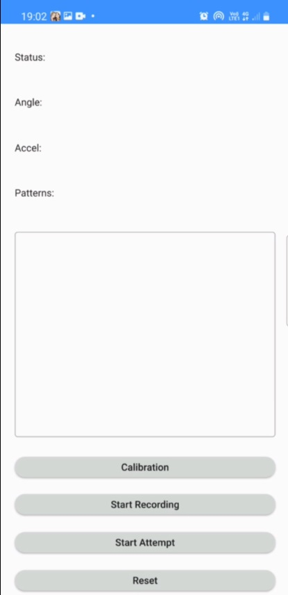

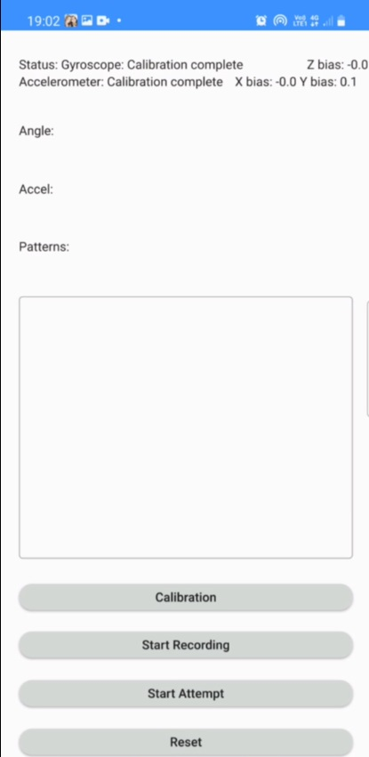

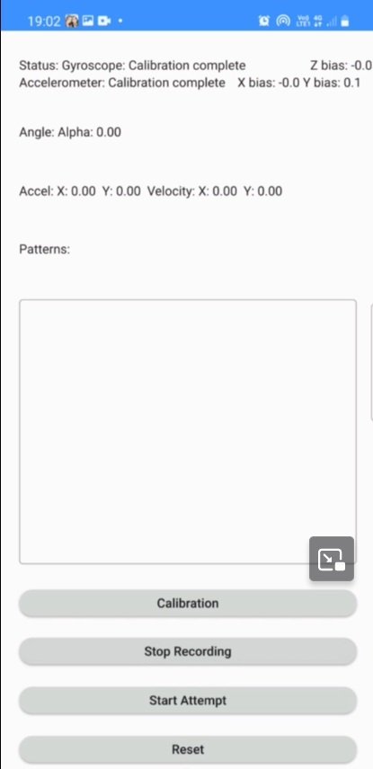

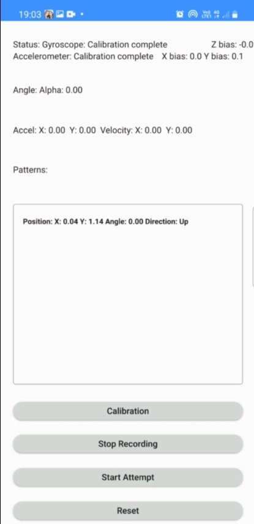

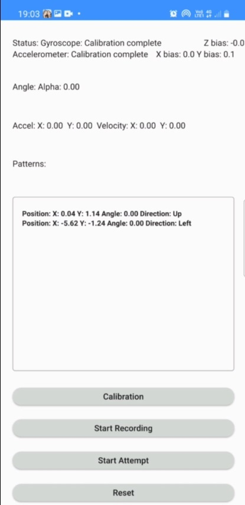

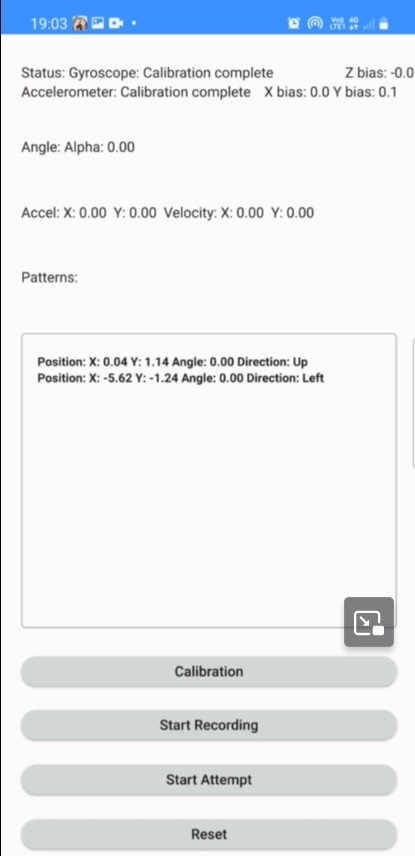

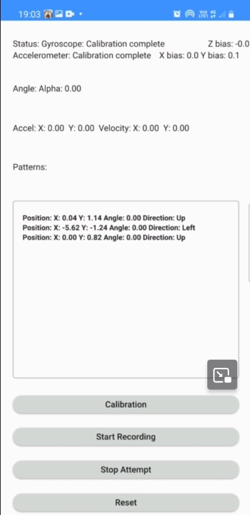

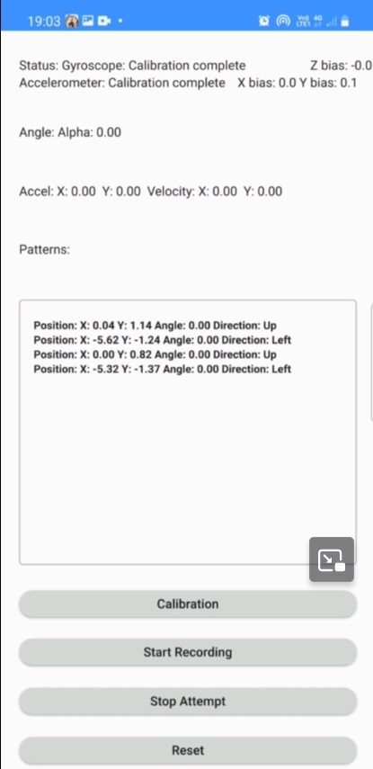

### Up and right with rotation


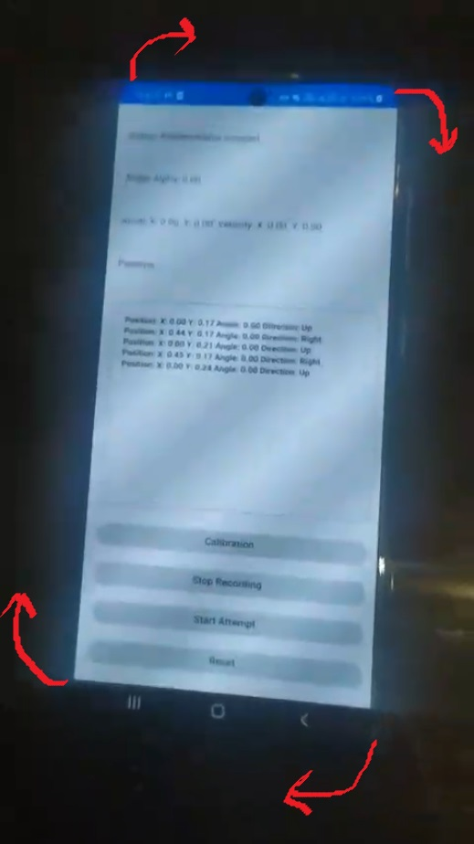

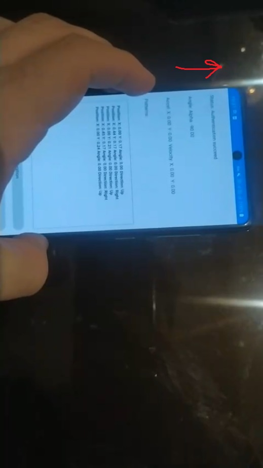

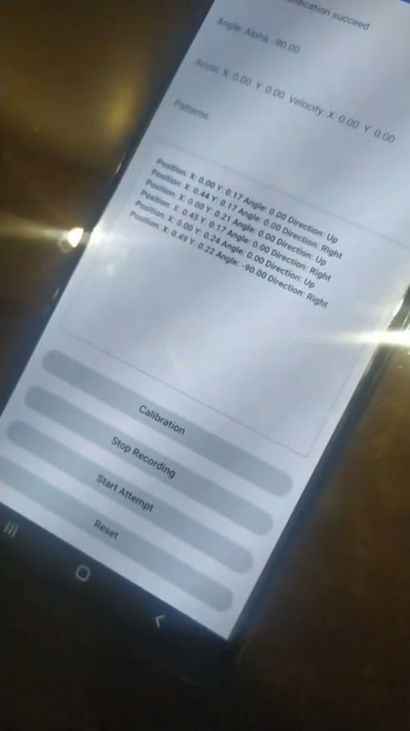

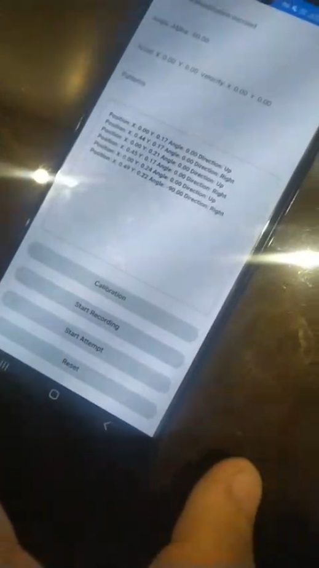

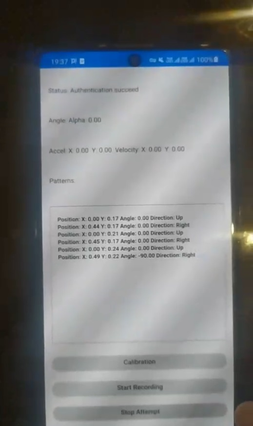

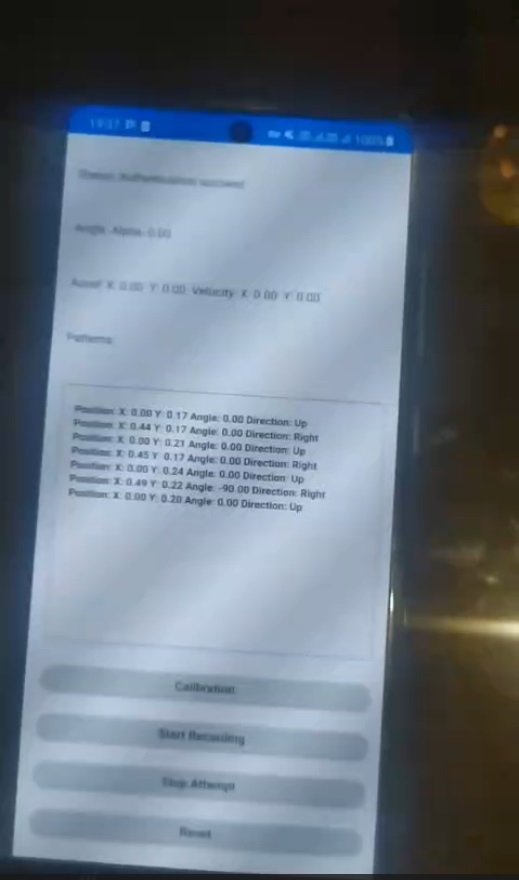

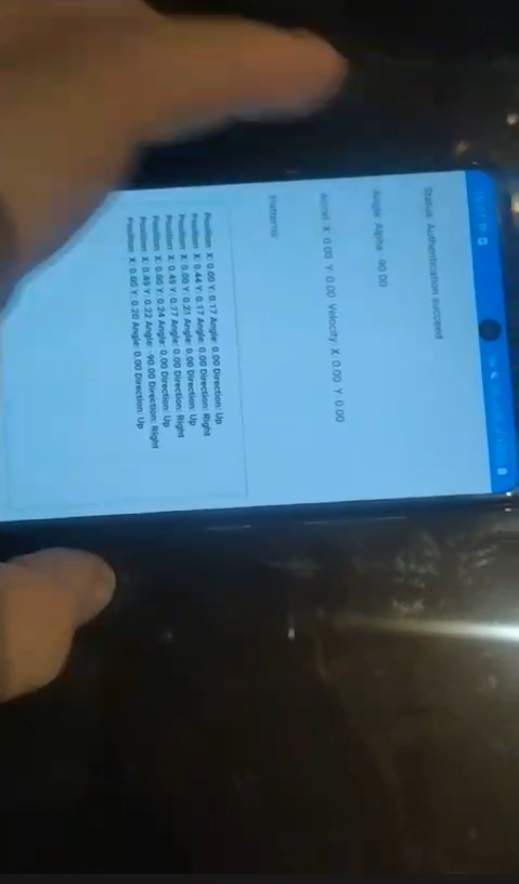

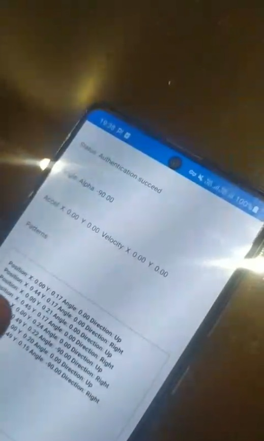

## Duties

- Initial introduction and initial setup -> Bardia Fatemeh
- ui -> Bardia Fatemeh
- Report -> Maryam
- Angle (with calibration) -> Fatima 
- Distance (with calibration) -> Berdia
- Performance and work analysis and work report -> Atta

## Reference

- https://doc.qt.io/qt-6/
- https://doc.qt.io/qt-6/qtsensors-index.html
- https://doc.qt.io/qt-6/signalsandslots.html
- https://doc.qt.io/qt-6/qtquick-index.html
- https://doc.qt.io/qt-6/qtquick-visualcanvas-scenegraph.html

## tools and libraries

- qt quick
- QtSensors/QAccelerometer
- QtSensors/QGyroscope
- QList
- QJsonArray
- QJsonObject
- QJsonDocument
- cmath

- Software platform specifications: qtquick with cpp
- Hardware: Android Qt 6.7 Clang arm64-v8a